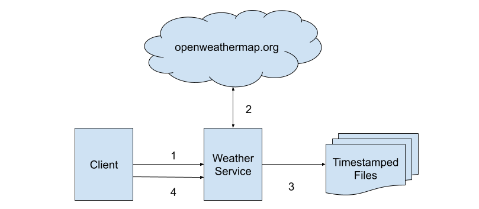

# Weather Service
## Architecture:

#### Sequence of flow
1. Client calls in with a list of cities embeded in file on the weather service REST api it returns a task id
2. Weather Service parses this file and converts list of cities names to list of city ids and fetchs weather info for each id.
3. Finally all the info is saved into files names as timestamp.
4. Client finally makes call to results api to check if the task was completed sucessfully.

## Failure modes
|Mode   |Impact   |Remediation   |
|---|---|---|
| Huge file sizes  | Downtime of service  | File size needs to be capped.  |
| Huge City Lists  |  DOS Attack, Downtime of system | Make the input API ASYNC.  |
| Malformed File  | Unable to process records  | Parser to check integrity of the file.  |
| Weak network to weather.org  | Unable to process records  | Retry n times before failling the request.  |

## Security Implications(Threat Model)
|Attack Vector   |Impact   |Remediation   |
|---|---|---|
| Authentication/Authorization  | User Identity not know for data processing | Basic HTTP Auth is required.  |
| Saving weather.org Credential  | API call limit exceed  | Secrets should be stored in the encrypted format.  |
| DOS Attack  | Downtime of system | Whitelisting of Client Endpoints on Ngnix or equivalent.  |
| Repudation  | False claims | Logging and auditing the incomming data is necessary.  |

## Rest Interface

Endpoint for Posting list of cities:
#### Request
```
POST /v1/weather [multipart/form-data]
Content-Disposition citylist="input.txt"
```
#### Response
|Response Code   |  Description |
|---|---|
| 202  | Request sucessfully accepted. Location header will have result id |
| 400  | Invalid file. |
| 413  | File is larger than allowed limit.  |

#### Request
```
GET /v1/results/{id}
```
#### Response
|Response Code   |  Description |
|---|---|
| 204  | Requested task was completed successfully |
| 200  | Requested task failed look into the response body for further details. |
```JSON
{
    "error_description":""
}
```
## Implemantation Details:
Please click following link to view implementation details [here](https://github.com/LRagji/W5R_Service/blob/master/Docs/Implementation.md)